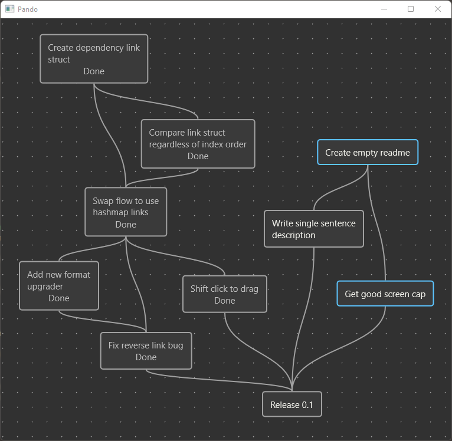
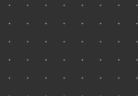
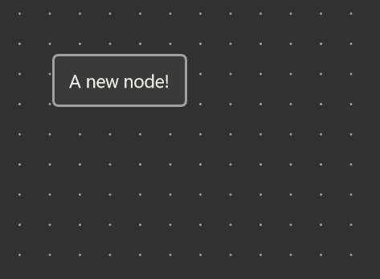
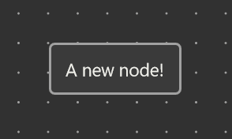
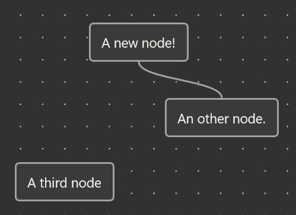
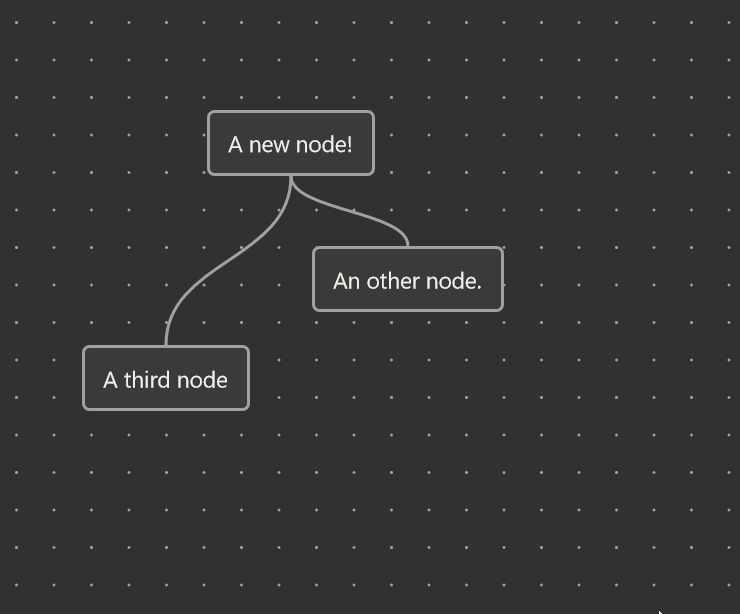
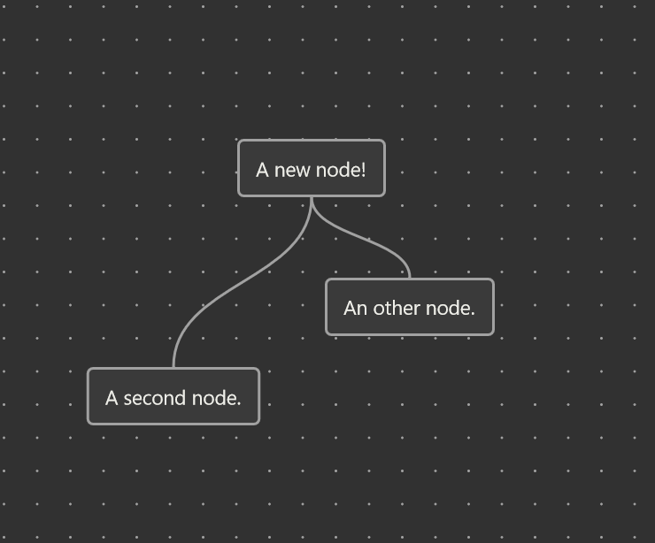

# Pando

### An infinite canvas for todo trees

Build a big picture for a project by laying out what needs to be done in what order.

## How

### Adding nodes

Left click the canvas to add a node. Type in some text and hit enter to commit it.

Alternatively, you can drag a new node off of a previous one by left click dragging from a connection spot to a new
location.

Right click a node to remove it.

### Making Progress

Double click a node to progress it. There are three states:
1. (Default) Waiting
2. In Progress
3. Done

### Making Connections

You can add and remove links between nodes by dragging to and from link spots on the top and bottom of nodes.

### Rearranging

You can easily organize nodes by dragging them around. Holding shift while dragging will move all nodes connected to the
one you are moving.

### Highlighting

Highlight nodes by holding control and clicking them.

## Build

To run the app, you must build it using rust. The app should run on mac, linux and windows. Once you install rust (I
recommend https://rustup.rs/), a simple `cargo build --release` will build a binary into `target/release`.
